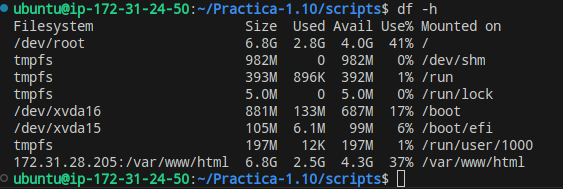
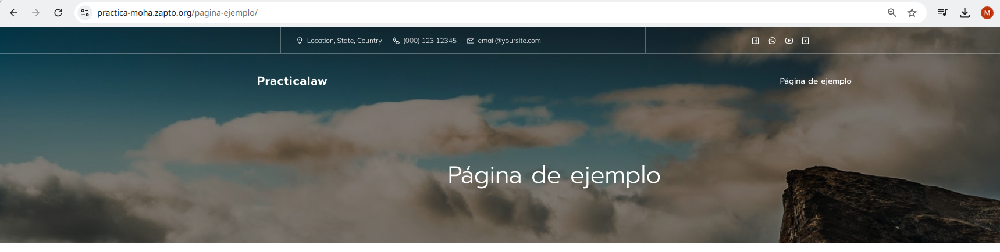

# Implantación de Wordpress en AWS utilizando una arquitectura de tres niveles


## Para realizar la arquitectura en tres niveles, vamos a necesitar un balanceador de carga funcionando como Proxy Inverso, dos máquinas frontend donde irá el wordpress, un servidor NFS y una máquina backend con mysql.

## 1 Realización script setup_loadbalancer

0. Importamos el archivo .env

    ```bash
     source .env
     ```

1.  Instalamos nginx

    ```bash
    apt install nginx -y
    ```

2. Deshabilitamos el virtualhost por defecto

    ```bash
    if [ -f "/etc/nginx/sites-enabled/default" ]; then
    unlink /etc/nginx/sites-enabled/default
    fi
    ```

3. Copiamos el archivo de configuración de Nginx

    ```bash
    cp ../conf/loadbalancer.conf /etc/nginx/sites-available
    ```
4. Sustituimos  los varoles de la plantilla del archivo de configuración

    ```bash
    sed -i "s/IP_FRONTEND_1/$IP_FRONTEND_1/" /etc/nginx/sites-available/loadbalancer.conf
    sed -i "s/IP_FRONTEND_2/$IP_FRONTEND_2/" /etc/nginx/sites-available/loadbalancer.conf
    sed -i "s/LE_DOMAIN/$LE_DOMAIN/" /etc/nginx/sites-available/loadbalancer.conf
    ```
5. Habilitamos el virtualhost  del balanceador de carga

   ```bash
    if [ ! -f "/etc/nginx/sites-enabled/loadbalancer.conf"]; then
    ln -s /etc/nginx/sites-available/loadbalancer.conf /etc/nginx/sites-enabled
    fi 
    ```
6. Reiniciamos el balanceador de carga

   ```bash
    systemctl restart nginx
    ```

## 2 Realización script setup_letsencrypt_certificate.sh

0. Importamos el archivo .env

    ```bash
     source .env
     ```

1. Instalamos y actualizamos snap

    ```bash
    snap install core
    snap refresh core
    ```

2. Eliminamos instalaciones previas de cerbot con apt

    ```bash
    apt remove certbot -y
    ```

3. Instalamos Certbot

    ```bash
    snap install --classic certbot
    ```
4. Solicitamos un cerficado a Let`s Encrypt
    ```bash
    sudo certbot --nginx -m $LE_EMAIL --agree-tos --no-eff-email -d $LE_DOMAIN --non-interactive
    ```
## 3 Realización script install_lamp_frontend.sh

0. Importamos el archivo .env

    ```bash
     source .env
     ```

1.  Instalamos el servidor web Apache (-y sirve para instalar sin preguntar)

    ```bash
    apt install apache2 -y
    ```

2. Habilitamos el módulo rewrite

    ```bash
    a2enmod rewrite

    ```

3. copiamos el archivo de configuración de apache2

    ```bash
    cp ../conf/000-default.conf /etc/apache2/sites-available
    ```
4. Instalamos PHP y algunos módulos de PHP para Apache y MySQL
    ```bash
    sudo apt install php libapache2-mod-php php-mysql -y
    ```
5. Reiniciamos el servicio de Apache

   ```bash
    systemctl restart apache2
    ```
## 4 Realización script install_lamp_backend

0. Instalamos mysql server

    ```bash
     apt install mysql-server -y
     ```

1. Configuramos el archivo /etc/mysql/mysql.conf/mysqld.cnf

    ```bash
    sed -i "s/127.0.0.1/$BACKEND_PRIVATE_IP/" /etc/mysql/mysql.conf.d/mysqld.cnf
    ```

2. Reiniciamos el servicio mysql

    ```bash
    systemctl restart mysql
    ```

## 5 Realización script deploy_frontend

0. Importamos el archivo .env

    ```bash
     rm -rf /tmp/wp-cli.phar
     ```

1. Descargamos WP-cli

    ```bash
    wget https://raw.githubusercontent.com/wp-cli/builds/gh-pages/phar/wp-cli.phar -P /tmp
    ```

2. Le damos permisos de ejecución

    ```bash
    chmod +x /tmp/wp-cli.phar
    ```

3. Movemos el script WP-CLI al directorio /usr/local/bin

    ```bash
    mv /tmp/wp-cli.phar /usr/local/bin/wp
    ```
4. Eliminamos instalaciones previas
    ```bash
    rm -rf ${WORDPRESS_DIRECTORY}*
    ```
5.  Descargamos el codigo fuente de wordpress

   ```bash
    wp core download \
    --locale=es_ES \
    --path=$WORDPRESS_DIRECTORY \
    --allow-root
    ```
6.  creamos el archivo de configuración 

   ```bash
    wp config create \
    --dbname=$WORDPRESS_DB_NAME \
    --dbuser=$WORDPRESS_DB_USER \
    --dbpass=$WORDPRESS_DB_PASSWORD \
    --dbhost=$BACKEND_PRIVATE_IP \
    --path=$WORDPRESS_DIRECTORY \
    --allow-root
    ```
7.  Configuramos nuestro worpress

    ```bash
    wp core install \
    --url=$LE_DOMAIN \
    --title=$WORDPRESS_TITULO \
    --admin_user=$WORDPRESS_USER \
    --admin_password=$WORDPRESS_PASSWORD \
    --admin_email=$ADMIN_EMAIL \
    --path=$WORDPRESS_DIRECTORY \
    --allow-root  
    ```
8. Instalamos y activamos el theme mindscape

    ```bash
    wp theme install mindscape --activate --path=$WORDPRESS_DIRECTORY --allow-root
    ```
9. Instalamos un plugin

    ```bash
    wp plugin install wps-hide-login --activate --path=$WORDPRESS_DIRECTORY --allow-root
    ```
10. Configuramos el plugin de WHL

    ```bash
    wp option update whl_page "$WORDPRESS_HIDE_LOGIN_URL" --path=$WORDPRESS_DIRECTORY --allow-root
    ```
11. Configuramos los enlaces permanentes

    ```bash
    wp rewrite structure '/%postname%/' \
    --path=/var/www/html \
    --allow-root
    ```
12. Copiamos el archivo .htaccess

    ```bash
    cp ../htaccess/.htaccess $WORDPRESS_DIRECTORY
    ```
13. Configuramos la variable $_SERVER['HTTPS']

    ```bash
    sed -i "/COLLATE/a \$_SERVER['HTTPS'] = 'on';" /var/www/html/wp-config.php
    ```
14.  Modificamos el propietario y el grupo del directorio /var/www/html

    ```bash
    chown -R www-data:www-data /var/www/html/
    ```
## 6 Realización script deploy_backend

0. Importamos el archivo .env

    ```bash
     source .env
     ```

1. Creamos la base de datos y el usuario para WordPress

    ```bash
    mysql -u root <<< "DROP DATABASE IF EXISTS $WORDPRESS_DB_NAME"
    mysql -u root <<< "CREATE DATABASE $WORDPRESS_DB_NAME"
    mysql -u root <<< "DROP USER IF EXISTS $WORDPRESS_DB_USER@'$FRONTEND_NETWORK'"
    mysql -u root <<< "CREATE USER $WORDPRESS_DB_USER@'$FRONTEND_NETWORK' IDENTIFIED BY '$WORDPRESS_DB_PASSWORD'"
    mysql -u root <<< "GRANT ALL PRIVILEGES ON $WORDPRESS_DB_NAME.* TO $WORDPRESS_DB_USER@'$FRONTEND_NETWORK'"
    ```

## 7 Realización script setup_nfs_server.sh

### Pasos:
0. Importamos el archivo .env

    ```bash
     source .env
     ```

1. Actualizamos los repositorios

    ```bash
    apt update
    ```

2. Instalamos el NFS Server

    ```bash
    apt install nfs-kernel-server -y
    ```

3. creamos el directorio que vamos a compartir

    ```bash
    mkdir -p /var/www/html -y
    ```
4. Modificamos el propietario y el grupo del directorio
    ```bash
    chown nobody:nogroup /var/www/html
    ```
5. copiamos el archivo de configuracion

   ```bash
    cp ../nfs/exports /etc/exports
    ```
6. Reemplazamos el valor de la plantilla /etc/exports

   ```bash
    sed -i "s#FRONTEND_NETWORK#$FRONTEND_NETWORK#" /etc/exports
    ```
7.  Reinciamos el servicio de NFS

    ```bash
    systemctl restart nfs-kernel-server
    ```
8. Creamos una carpeta nfs y dentro estará el exports con el siguiente   contenido

    ```bash
    /var/www/html 172.31.0.0/16(rw,sync,no_root_squash,no_subtree_check)
    ```
Esto permite las conexiones desde el servidor NFS a dicho rango de IPs para que puedan conectarse los frontales.


## 8 Realización script setup_nfs_client.sh
### Pasos:

1. Importamos el archivo .env
 
   ```bash
    source .env
   ```
2. Actualizamos los repositorios

    ```bash
    apt update
    ```
3. Instalamos el cliente NFS

    ```bash
    apt install nfs-common -y
    ```
4. configuramos la entrada para montar un directorio NFS en el sistema.

    ```bash
    sed -i "/LABEL=UEFI/a $NFS_SERVER_IP:/var/www/html /var/www/html  nfs auto,nofail,noatime,nolock,intr,tcp,actimeo=1800 0 0" /etc/fstab
    ```
5. recargamos la configuración del sistema

    ```bash
    systemctl daemon-reload
    ```
6. Hacemos el montaje

    ```bash
    mount $NFS_SERVER_IP:/var/www/html /var/www/html
    ```
El archivo setup_nfs_server.sh se ejecutaría en la servidor NFS y el setup_nfs_client.sh se ejecutaría en los dos frontales para que monten su directorio /var/www/html en el /var/www/html del servidor así permite a los clientes que accedan a la página poder descargar el mismo plugin por ejemplo en los diferentes Frontends.



Vemos como al hacer un df -h, en la IP del servidor NFS está montado el directorio /var/www/html



